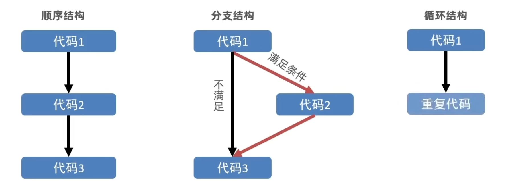
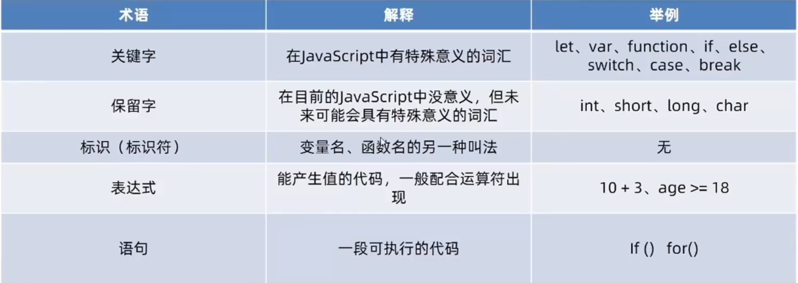
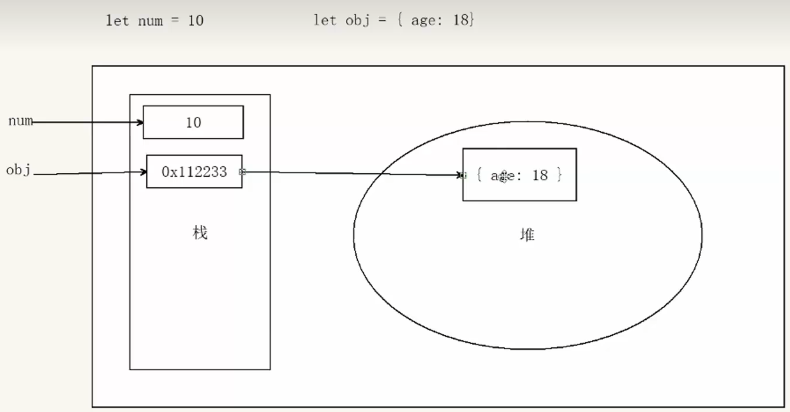
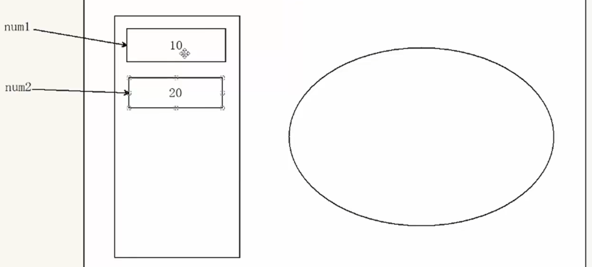

# JavaScript基础

## JavaScript简介

### 1.1 JavaScript是什么

> JavaScript是一种运行在客户端(浏览器)的编程语言,实现人机交互效果
>
> mdn web docs  进行

#### 作用

- 网页特效
- 表单验证
- 数据交互
- 服务器编程(node.js)

#### JavaScript的组成

- ECMAScript:
  - 规定了js基础语法核心知识
    - 比如:变量、分支语句、循环语句、对象等等

- Web APIs：
  - DOM 操作文档，比如对页面元素进行移动、大小、添加删除等操作
  - BOM 操作浏览器，比如页面弹窗，检测窗口宽度、存储数据到浏览器等等


### 1.2 JavaScript书写位置

#### 1、内部JavaScript

> 直接写在html文件内，用script标签包住

规范 ：script标签写在</body>上面（放在HTML文件底部是原因是浏览器会按照代码在文件中的顺序加载HTML

```html
<body>
    <script>
        // 页面弹出警示框
        
    </script>
</body>
```

#### 2、外部JavaScript

>代码写在以 .js结尾的文件里，通过script标签引入到html页面中。

```html
<body>
    <script src="my.js">
    	// 中间不要写内容，默认忽略
    </script>
</body>
```

#### 3、内联JavaScript

>代码写在标签内部

```html
<body>
    <button onclick="alert('逗你玩~~~')">点我月薪过万</button>
</body>
```

1.3 JavaScript注释和结束符

### 1.注释

- 单行注释

  - 符号：//

  - 快捷键：ctrl+/

  - ```html
    <body>
        <script src="my.js">
        	// 这是单行注释噢
        </script>
    </body>
    ```

- 多行注释

  - 符号：/* */

  - 快捷键：shift+alt+a

  - ```html
    <body>
        <script src="my.js">
        	/*
        	这是多行注释噢
        	*/ 
        </script>
    </body>
    ```

### 2.JavaScript结束符

- 符号： ;
- 实际开发中，可写可不写
- 结束符要么每句都写，要么都不写（按照团队要求）


### 1.4 JavaScript输入输出语法

> 人和计算机打交道的规则约定

#### 输出语法

- 语法1：document

  - ```javascript
    documet.write('要输出的内容')
    ```

  - **作用**：向body内输出内容

  - **注意**：如果输出的内容写的时标签，也会被解析成网页元素

- 语法2：alert

  - ```javascript
    alert('要弹出的内容')
    ```

  - **作用**：页面弹出警告对话框

- 语法3：console

  - ```javascript
    console.log('控制台打印')
    ```

  - **作用**：控制台输出语法，程序员调试使用

#### 输入语法

- 语法：prompt

  - ```javascript
    prompt('请输入您的姓名：')
    ```

  - **作用**：显示一个对话框，对话框中包含一条文字信息，用来提示用户输入文字

### JavaScript代码执行顺序

- 按HTML文档流顺序执行JavaScript代码
- alert() 和 prompt()它们会跳过页面渲染先被执行


### 1.5 字面量

> 在计算机科学中，字面量（literal）是在计算机中描述 事/物
>
> 字面量是值的表示方式，而变量是存储值的容器。

#### 例如

- 1000 --> 数字字面量
- '程序员' --> 字符串字面量
- [] 数组字面量 {} 对象字面量


## 变量

> 变量是计算机存储数据的“**容器**”，变量不是数据本身

### 2.1 变量的基本使用

#### 1、声明变量

```javascript
let 变量名
```

#### 2、变量的赋值

```javascript
变量 = 数据 
```

### 3、变量的初始化

```javascript
let 变量名 = 数据
```

####  4、变量的本质

>程序在内存中申请的一块用来存放数据的小空间

#### 5、变量命名规则与规范

##### 规则：

- 不能用关键字
- 只能用下划线、字母、数字、$符，且不用以数字开头
- 严格区分大小写

##### 规范：

- 起名要有意义
- 遵循小驼峰命名法
  - 第一个单词首字母小写，后面每个单词的首字母大写

### 变量拓展

#### let 和 var的区别

var声明

- 可以先使用再声明（不合理）
- var声明过的变量可以重复声明（不合理）

#### 7、数组

> 数组（Array），将**一组数据存储再单个变量名下**的方式，数组可以存储任何类型的数据

##### 声明方式

```javascript
let 数组名 = [数据1, 数据2, 数据3, . . . ,数据n]
```

##### 数据的基本使用

```javascript
使用数组： 数组名[索引号] // 从0开始
```

## 常量

> 使用const声明的变量称为**常量**，当某个变量永远**不会改变**时，就可以使用const

### 注意

常量不允许重新赋值，声明时必须赋值

## 数据类型

### JS数据类型分类

- #### 基本数据类型
  
  - number 数字型
  - string 字符串型
  - boolean 布尔型
  - undefined 未定义型
  - null 空类型
- #### 引用数据类型
  
  - object 对象
  - function 函数
  - array 数组

### 数字类型

> 整数、小数、整数、负数，都是数字类型
>
> 注意：JavaScript是弱数据类型语言，只有赋值了之后才知道是什么类型

#### 算数运算符

+、 - 、* 、/ 、%(取模)

NaN：代表计算错误


### 字符串类型

> 通过单引号(' ')、双引号(" ")或反引号(`)包裹的数据都叫字符串

必要时使用转义符 \ 

#### 字符串拼接

运算符：+ 可以实现字符串拼接


#### 模板字符串

##### 使用场景

- 拼接字符串和变量

##### 语法

- `` (反引号)
- 内容拼接变量时使用${}包住变量

```javascript
<script>
        let age = 18
        document.write(`我今年${age}岁了`)
</script>
```

#### 布尔类型

> 只有两个固定的值true（真）、false（假）


#### 未定义类型

> 只声明变量，不赋值的情况下，变量的默认值为**undefined**


#### 空类型

>代表"无"、"空" 或 "值未知"
>
>**使用场景**：将来有个变量里面存放的是一个对象，但是对象还没创建好，可以先给个null

```javascript
console.log(undefined +1)  // = NaN
console.log(nulll +1) // = 1
```

### 类型检测

> 通过**typeof**关键字检测数据类型

#### 语法

```javascript
typeof x // (常用写法)作为运算符
typeof(x) // 函数形式
```

## 类型转换

### 隐式转换

> 某些运算符被执行时，系统内部自动将数据类型进行转换

#### 规则

- +号两边只要有一个是字符串，都会把另外一个转成字符串
- **除了+以外**的算数运算符 比如 -  *  /  等都会把数据转成数字类型

#### 小技巧

- +号作为**正号解析**可以转换成数字型

  - ```javascript
    console.log(+'123') // 此时123将转换为数字型
    ```

- **任何数据**和字符串相加的结果都是字符串

### 显示转化

> 写代码告诉系统要转换成什么数据类型

#### 语法

```javascript
Number()  // 转换为数字型
	parseInt   // 只保留整数
    parseFloat  // 可以保留小数
```

#### 练习

输入两个数，计算和，打印到弹窗中

```javascript
let num1 = Number(prompt('请输入第一个数'))
let num2 = Number(prompt('请输入第二个数'))
let sum = num1 + num2
 alert(`这两个数和为：${num1 + num2}`)
```

#### 案例

##### 渲染表格

```html
<!doctype html>
<html lang="en">
<head>
    <meta charset="UTF-8">
    <meta name="viewport"
          content="width=device-width, user-scalable=no, initial-scale=1.0, maximum-scale=1.0, minimum-scale=1.0">
    <meta http-equiv="X-UA-Compatible" content="ie=edge">
    <title>Document</title>
    <style>
        h2 {
            text-align: center;
        }

        table {
            border-collapse: collapse;
            height: 80px;
            margin: 0 auto;
            text-align: center;
        }

        th, td {
            padding: 5px 20px;
        }

        table, th, td {
            border: 1px solid #000000;
        }
    </style>
</head>
<body>
<h2>订单确认</h2>

<script>
    // 用户输入
    let price = Number(prompt('请输入商品价格'))
    let num = Number(prompt('请输入商品数量'))
    let address = prompt('请输入收货地址')
    // 计算总价
    let total = price * num
    // 页面打印
    document.write(`
            <table>
                <tr>
                    <th>商品名称</th>
                    <th>商品价格</th>
                    <th>商品数量</th>
                    <th>总价</th>
                    <th>收货地址</th>
                </tr>
                <tr>
                    <td>小米手机</td>
                    <td>${price}元</td>
                    <td>${num}</td>
                    <td>${total}元</td>
                    <td>${address}</td>
                </tr>
            </table>

        `)
</script>
</body>
</html>
```

## 运算符

### 赋值运算符

- = ：将等号**右边的值**赋予左边，要求左边必须是一个**容器**
- +=：num += 5 **==** num = num + 5
- -=
- *=
- /=
- %=

### 一元运算符

> 众多的JavaScript的运算可以根据所需表达式的个数，分为一元运算符、二元运算符、三元运算符

#### 自增

- 符号：++

- 作用：让变量的值+1

- 语法：

  - 前置自增：

    - ```javascript
      let i = 1
      ++i // 每次加一
      ```

  - 后置自增：

    - ```javascript
      let i = 1
      i++ //每次加一
      ```

  - 区别：

    - 单独使用没有区别

    - ```javascript
      ++i +1 =3 //前置自增:先自加再使用（++在前，先加）
      1++ +1 =2 //后置自增:先使用再自增（++在后，后加）
      //前自增的运算级别高先自增再相加，后自增为先相加再（i自增）注意是i自增，不是结果自增。
      ```

- 用法：

  - 前置自增和后置自增独立使用是没有**任何区别**
  - 一般开发中都是单独使用
  - i++ 后置自增会使用**相对较多**，并且都是**单独使用**

#### 自减

- 符号：--
- 作用：让变量减一


### 比较运算符

- '>'
- '<'
- '>='
- '<='
- ==
- ===: **左右两边是否类型和值都相等**
  - NaN不等于任何人，包括他自己
- !=
- !==: 左右两边石佛不全等‘

#### 对比

- = 单等是赋值
- == 是判断
- === 是全等
- 开发中判断是否相等，**推荐使用 ===**

#### 注意

- 字符串比较，按照ASCII码比较
- NaN不等与任何值，包括它本身
- 尽量不要比较小数
  - 小数参与运算先转换为整数

### 逻辑运算符

#### 使用场景：

- 用于解决多重条件判断
  - 例如：5 < num < 10
  
    ```javascript
    num > 5 && num < 10
    ```

#### 逻辑运算符

- &&  与：一假则假
- || 或：一真则真
- ! 非：取反、真变假，假变真 ``

### 运算符优先级

| 优先级 | 运算符     | 顺序               |
| ------ | ---------- | :----------------- |
| 1      | 小括号     | （）               |
| 2      | 一元运算符 | ++   --  !         |
| 3      | 算数运算符 | 先 * /  % 后 + -   |
| 4      | 关系运算符 | >    >=     <   <= |
| 5      | 相等运算符 | ==   =!  ===   !== |
| 6      | 相等运算符 | 先  &&  后 \| \|   |
| 7      | 赋值运算符 | =                  |
| 8      | 逗号运算符 | ,                  |

## 表达式和语句的区别

表达式：表达式是可以被求值的代码，JavaScript引擎会将其计算出一个结果

语句：是一段可以执行的代码

​			比如：proompt()可以弹出一个输入框，还有if语句	for循环语句等等

区别：

- 表达式可以被被求值，所以它可以写在赋值语句的右侧
- 语句不一定有值.
- 某些情况，也可以把表达式理解为表达式语句，因为他是在计算结果，但不是必须的成分

## 流程控制语句

### 三大流程控制语句

- 顺序结构（从上往下依次执行）
- 分支结构（根据条件选择执行代码）
- 循环结构（某段代码被重复执行）



## 分支语句

### 三大分支语句

- if分支语句
- 三元运算符
- switch 语句

## if分支语句

if语句三种使用：单分支、双分支、多分支

### 单分支

- ```javascript
  if (条件) {
     	满足条件要执行的代码
  }
  ```

  - 括号内的条件为true时，进入大括号里执行代码
  - 小括号内的结果若不是布尔类型时，会发生隐式转换转为布尔类型
  - 如果大括号只有一个语句，大括号可以省略（不提倡这样做）

### 双分支

- ```javascript
  if (条件) {
      1、满足条件要执行的代码
  } else {
      2、不满足条件要执行的代码
  }
  ```

  - 括号内条件为true时，执行第一串代码

  - 括号内条件为false时，执行第二串代码

  - ```javascript
    练习：判断是否为闰年
    //  用户输入
    let year = Number(prompt('请输入年份'))
    // 判断输出
    if (year % 4 === 0 && year % 100 !== 0  || year % 400 !== 0) {
    	alert(`${year}是闰年`)
    } else {
    	alert(`${year}不是闰年`)
    }
    ```

### 多分支

- ```javascript
  if (条件1) {
      代码1
  } else if (条件2) {
      代码2
  } else if (条件3) {
      代码3
  } else {
      代码n
  }
  ```

  - 先判断条件1，满足条件1就执行条件1，其他不执行
  - 若不满足条件1则向下判断条件2，满足则执行代码2，其他不执行
  - 若依然不满足则继续往下，以此类推
  - 若以上条件都不满足，执行else里的代码n
  - 注意：可以写N个条件

## 三元运算符

- 语法：

  - ```javascript
    条件 ? 满足条件执行的代码 : 不满足条件执行的代码
    ```

- 使用场景：比if双分支**更简单**的写法，可以使用三元表达式

- 一般用同于取值

  - ```javascript
    let max = 3 < 5 ? 5 : 3  
    // 定义一个变量max 如果3 < 5为真，则max=5，否则max=3
    ```

  - ```javascript
    // 数字补0
    // 用户输入
    let num = +prompt('请输入数字')
    // 判断输出
    num = num < 10 ? '0' + num : num
    alert(num)
    ```


## switch分支语句

- 语法：

  - ```javascript
    switch (数据) {
    	case 值1:
    		代码1
    		break
    	case 值2:
    		代码2
    		break
    	default:
    		代码n
    		break
    }
    ```

- 释义：

  - 找到跟小括号里数据**全等**的case值，并执行里面对应的代码
  - 若没有全等 === 的则执行default里的代码

- 注意：一定要加上break

## if多分支语句和switch的区别

### 共同点

- 都能实现多分支选择，多选1
- 大部分情况下可以互换

### 区别

- switch...case语句通常处理case为比较**确定值**的情况，而if...else..语句更加灵活，通常用于**范围判断**
- switch 语句进行判断后直接执行程序语句，效率更高，if...else语句有几种判断情况，就判断几次
- switch 一定要注意 必须是 === 全等（**数据类型**），注意**break**

### 结论

- 当分支比较少是，if...else语句执行效率高
- 当分支比较多时，switch语句执行效率高，而且结构清晰

## while循环

**循环**重复执行一些操作

- 释义：在**满足条件**期间重复执行某些代码

- 语法：

  - ```javascript
    while (循环条件) {
        要重复执行的代码（循环体）
    }
    ```

  - 当小括号里的条件为true才会进入**循环体**执行代码

  - while大括号里代码执行完毕后不会跳出，而是继续回到小括号里判断条件是否满足，若满足又执行大括号里的代码，然后再回到小括号判断条件，直到括号内条件不满足，即跳出

- **while循环三要素**

  - 变量的其实值

  - 终止条件

  - 变量变化量（自增或自减）

  - ```javascript
    let i = 1 //变量起始值
    while(i<=3){ //终止条件
        document.write('我会循环3次')
        i++  //变量变化量
    }
    ```

## for循环

### for循环的基本使用

- 作用：重复执行代码

- 好处：把声明起始值、循环条件、变化值写到一起，让人一目了然，时最常用的循环形式

- 语法：

  - ```javascript
    for (变量起始值; 终止条件; 变量变化量){
        //循环体
    }
    ```

  - ```javascript
    // 无限循环
    for (; ;) {
        console.log(11)
    }
    ```

### 循环嵌套

- 语法

  - ```javascript
    for (外部声明记录循环次数的变量; 循环条件; 变化值) {
        for (内部声明记录循环次数的变量; 循环条件; 变化值){
            循环体
        }
    }
    ```

## for循环和while循环的区别

- 当明确了循环的次数的时候推荐使用for循环
- 当不明确循环的次数的时候推荐使用while循环

## 退出循环

### break 和 continue

- 循环结束：
  - break：退出循环
  - continue：结束本次循环，继续下次循环
- 区别：
  - break：退出整个循环，一般用于结果已经得到，后续的循环不需要时
  - continue：退出整个循环，一般用于结果已经得到，后续的循环不需要的时候可以使用

## 数组

### 什么是数组

- 数组（array）是一种可以按顺序保存数据的**数据类型**
- 为什么要数组
  - 多个数据可以用数组保存，放到单个变量中，方便管理


### 数组的基本使用

- 声明语法

  - ```javascript
    1、字面量声明数组
    let 数组名 = [数据1、数据2、数据4,...,数据5]
    ```

  - ```javascript
    2、使用new Array 构造函数声明
    let arr = new Array(1,2,3,4)
    ```

- 数组里面可以存放任意**数据类型**

- 可以通过下标（从0开始）取值

  - ```javascript
    数组名[下标]
    ```

### 遍历数组

```javascript
let name = ['马超','赵云','张飞','关羽','黄忠']
    for (let i = 0; i < name.length; i++) {
        document.write(`${name[i]}<br>`)
    }
```

### 求数组最大值最小值

```javascript
let arr = [2, 6, 1, 77, 52, 99, 7]
let max = arr[0]
let min = arr[0]
for (i = 1; i < arr.length; i++) {
	if (arr[i] > max) {
		max = arr[i]
	}
	if (arr[i]<min) {
		min = arr[i]
	}
}
document.write(`最大值为${max},最小值为${min}`)
```

### 数组查

- 通过下标查值

  - ```javascript
    数组[下标]
    ```

### 数组改

- 通过下标修改

  - ```javascript
    let arr = []
    arr[0] = 1  // 此时arr = [1]
    arr[1] = 5  // 此时arr = [1,5]
    ```

  - ```javascript
    //给所有的数组元素后面加上指定的字符
    let arr = ['pink', 'red', 'green']
    for (let i = 0; i < arr.length; i++) {
    	arr[i] += '老师'
    }
    ```

### 数组增

- 通过**数组.push()**方法将一个或多个元素添加到数组**末尾**，并返回该数组的新长度

  - ```javascript
    arr.push(元素1,元素2,元素3,...,元素n)
    ```

  - 返回值：调用该方法时，新的length属性值将被返回

  - ```javascript
    console.log(arr.push('deeppink'))
    ```

  - 返回值是  arr.length

- 通过**数组.unshift(新增的内容)**将一个或多个元素添加到数组的**开头**，并返回该数组的新长度

  - ```javascript
    arr.unshift(元素1,元素2,元素3,...,元素n)
    ```

### 数组删

- **数组.pop()**能删除数组中的**最后一个**元素，并返回该元素的值

  - ```javascript
    arr.pop()  //一定要带括号
    ```

- **数组.shift()**删除数组中的**第一个**元素，并返回该元素的值

  - ```javascript
    arr.shift()  //一定要带括号
    ```

- **数组.splice()**删除指定元素

  - ```javascript
    arr.splic(start,deleteCount)  //start起始位置，deleteCount删除几个元素（缺省时删到最后）
    ```

  - 

### 数组筛选

- 将数组[2, 0, 6, 1, 77, 0, 52, 0, 25, 7]中大于10的数存到新数组中

  - ```javascript
    let arr = [2, 0, 6, 1, 77, 0, 52, 0, 25, 7]
    let newArr = []
    for (let i = 0; i < arr.length; i++) {
    	if (arr[i] >= 10) {
    	}
    }
    ```

- 将数组[2,0,6,1,77,0,52,0,25,7]中的0去掉后，形成一个不包含0的新数组

  - ```java
    let arr = [2, 0, 6, 1, 77, 0, 52, 0, 25, 7]
    let newArr = []
    for (let i = 0; i < arr.length; i++) {
    	if (arr[i] !== 0){
    		newArr.push(arr[i])
    	}
    }
    ```

### 冒泡排序

```javascript
let arr = [5, 3, 1, 2, 4]
for (let i = 0; i < arr.length - 1; i++) {
	for (let j = 0; j < arr.length - i - 1; j++) {
	if (arr[j] > arr[j+1]) {
		let temp = arr[j]
			arr[j] = arr[j+1]
			arr[j+1] = temp
		}
	}
}
```

## 作用域

==一段程序代码中所用到的名字并不总是有效和可用的，而限定这个名字的**可用性的代码范围**就是这么名字的**作用域**==

作用：提高程序逻辑的局部性，增强可靠性，减少名字冲突

### 全局作用域

==做用于所有代码执行的环境==

- 整个script标签内部
- 一个独立的JS文件

### 局部作用域

==作用域函数内的代码环境==

### 全局变量与局部变量

==根据作用与的部疼痛，变量可以分为：全局变量与局部变量==

- 全局变量
  - 在任何区域都可以访问和修改
- 局部变量
  - 只能在当前函数内部访问和修改
  - 形参可以看作函数的局部变量

### 变量的访问原则

-  只要是代码，就至少有一个作用域
- 写在函数内部的局部作用域
- 如果函数中还有函数，那么在这个作用域中就又可以诞生一个作用域
- 访问原则：**在能够访问到的情况下先局部，局部没有在找全局**

## 函数

==function,是被设计为**执行特定任务**的代码块（代码复用）==

说明：函数可以把具有相同或相似逻辑的代码封装起来，通过调用执行这些封装代码逻辑，有利于**精简代码方便使用**

### 函数的使用

#### 函数声明

- 语法

  - ```javascript
    functioon 函数名(参数1，参数2，……，参数n) {
        函数体
        return 返回值
    }
    ```

- 命名规范

  - 和变量命名基本一致
  - 尽量小驼峰式命名法
  - 前缀应该为动词

#### 函数调用

- 语法

  - ```javascript
    函数名(参数1，参数2，……，参数n)
    ```

  - 注意：声明（定义）的函数必须调用才会真正被执行，使用()调用函数

### 函数的参数以及默认参数

- 参数的分类
  - ==函数定义时的参数时形参==
  - ==函数调用时的参数叫实参==
    - 实参可以是变量
    - 实参少于形参，会自动填上undefined
    - 实参多余形参，剩余的实参会被忽略

#### 函数的默认参数

- 语法

  - ```javascript
    functioon 函数名(参数1 = 0，…… ) {
        函数体
    }
    ```

  - 释义

    - 当函数在调用时，没有传递参数，则会使用形参默认值
    - 默认值只会在缺少实参时才会被执行

### 函数的返回值

==当调用斗个函数时，这个函数会返回一个结果出来，这个结果就是返回值==

**作用**

- 函数内部不需要输出结果，而是返回结果
- 对执行结果的扩展性更高，可以让其他的程序使用这个结果

```javascript
function fn(){
    return 20
}
let re = fn()
```

- **释义**：
  - 当函数 fn() 被执行时，fn() = 20
  - 相当于定义了一个变量 **函数() = 返回值**
  - 所以re = fu() = 20
- **细节**：
  - return 立即结束当前行数，后面的代码不会被执行
  - return 不能换行写
  - 函数如果没有写return则函数的返回结果是：undefined

### 匿名函数

#### 1.函数表达式

语法

```javascript
// 定义
let fn = function(参数) {
    console.log('函数表达式')
}
// 调用
fn(参数)
```

##### 函数表达式和具名函数的区别

1. 具名函数的表用可以写到任何位置（可以先调用再声明）
2. 函数表达式需先声明后调用

#### 2.立即执行函数

语法

==使用场景：避免全局变量之间的污染==

```javascript
//方式1
(function (形参) { console.log(11) })(实参);
//方式2
(function (形3参){ console.log(11) }(实参));
```

注意：不需要调用，立即执行，必需要加上 **;**

## 逻辑中断

> 只存在与&& 和 || 中，当满足一定条件会让右边代码不执行
>
> ==通过左边就能得到整个式子的结果，右边的式子将不会被执行==

- && 左边为false 就中断
- | | 左边true 就中断
- 无论是&& 还是 || ，运算结果都是最后被执行的表达式值，一般用在变量赋值

## 转换为布尔型

```javascript
console.log(Boolean('pink'))  // 强制转换为布尔型
```

=='空字符串'、undefined、null、false、NaN转换为布尔值后为，其余都为true==

## 对象

> 对象（object）：一种数据类型
>
> ==是一种无序的数据集合==用于描述某个事物

### 声明对象

```javascript
let 对象名 = {
    属性:值
    属性:值
    属性:值
}
let 对象名 = new Object{}
```

### null

null 也是 JavaScript 中数据类型的一种，通常只用它来表示不存在的对象。使用 typeof 检测类型它的类型时，结果为 `object`。

### 对象由属性和方法组成

- 属性：信息或特征，本质上是一个变量
- 方法：功能或行为，本质上是一个函数

#### 属性

- 数据描述性的信息称为属性
- 属性都是成对出现的，包括姓名和值，姓名和值之间用`;`隔开
- 多个属性之间用 `,`隔开
- 属性是依附在对象上的变量
- 属性名为`空格`或者
- 属性的本质是一个变量

### 对象操作

### 查

> 使用`.`获得对象中属性对应的值
>
> 通过对象名[属性名]获得对应属性值

```javascript
对象名.属性名
对象名['属性名']
```

### 改

```javascript
对象名.属性 = 新值
```

### 增

```javascript
对象名.新属性 = 新值
```

#### 删

```javascript
delete 对象名.属性
```

### 对象的方法

```javascript
// 声明
let obj = {
    uname : '刘德华',
    song: function () {
        console.log('冰雨')
    }
}
// 调用
obj.song()
```

- 方法是由方法名和函数两部分构成，它们之间使用`:`分隔
- 多个属性之间使用`,`分隔
- 方法是依附在对象中的函数
- 方法名可以使用" "或' ' ，一般情况下省略，除非遇到特殊符号
- 方法的本质是函数

### 遍历对象

```javascript
for (let k in obj) {
	console.log(k)  // 属性名（字符串型，带引号）
	console.log(obj[k])  // 值
}
```

==for in不提倡用于遍历数组，因为k时字符串==

### 内置对象

#### Math

`Math` 是 JavaScript 中内置的对象，称为数学对象，这个对象下即包含了属性，也包含了许多的方法。

##### 属性

- Math.PI，获取圆周率

```javascript
// 圆周率
console.log(Math.PI);
```

##### 方法

- Math.random，生成 0 到 1 间的随机数

```javascript
// 0 ~ 1 之间的随机数, 包含 0 不包含 1[0,1)
Math.random()
// 生成 N ~ M 之间的随机数
Math.floor(Math.random() * (M - N + 1)) + N
```

- Math.ceil，数字向上取整

```javascript
// 舍弃小数部分，整数部分加1
Math.ceil(3.4)
```

- Math.floor，数字向下取整

```javascript
// 舍弃小数部分，整数部分不变
Math.floor(4.68)
```

- Math.round，四舍五入取整

```javascript
// 取整，四舍五入原则
Math.round(5.46539)
Math.round(4.849)
```

- Math.max，在一组数中找出最大的

```javascript
// 找出最大值
Math.max(10, 21, 7, 24, 13)
```

- Math.min，在一组数中找出最小的

```javascript
// 找出最小值
Math.min(24, 18, 6, 19, 21)
```

- Math.pow，幂方法

```javascript
// 求某个数的多少次方
Math.pow(4, 2) // 求 4 的 2 次方
Math.pow(2, 3) // 求 2 的 3 次方
```

- Math.sqrt，平方根

```javascript
// 求某数的平方根
Math.sqrt(16)
```

数学对象提供了比较多的方法，这里不要求强记，通过演示数学对象的使用，加深对对象的理解。

## 术语解释



## 基本数据类型和引用数据类型

简单类型有叫做基本数据类型或者==值类型==，复杂数据类型又叫做==引用数据类型==

- 值类型：在存储变量中存储的是==值本身==，因此叫做值类型,放在栈里
  - string，number，boolean，undefined，null
- 引用类型：在存储时变量中存储的仅仅是==地址（引用）==，因此叫做引用数据类型，地址在栈里，内容放在堆里
  - 通过new关键字创建的对象（系统对象、自定义对象），如Object、Array、Date等



```javascript
// 案例
let num1 = 10
let num2 = num1
num2 = 20
console.log(num1) // 结果为10
```



```javascript
let obj1 = {
    age:18
}
let obj2 = obj1
obj2.age = 20
console.log(obj1.age) // 输出 20
```

## Web APIs
