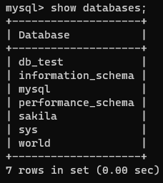
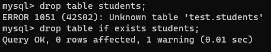
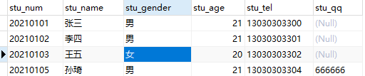
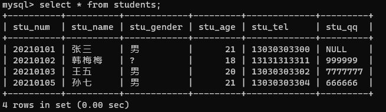

# 一、MySQL简介

## 1.1 数据库介绍 

- 数据库概念 术语介绍 

## 1.2 MySQL数据库 

- 下载、安装、配置、卸载 
- MySQL客户端⼯具的安装及使⽤ 

## 1.3 SQL 结构化查询语⾔ 

- 什么是SQL 
- SQL操作数据（CRUD操作：添加、查询、修改、删除） 

## 1.4 SQL ⾼级 

- 存储过程 
- 索引
-  触发器、视图

##  1.5 数据库设计 

- 数据库设计步骤
-  数据库设计范式
-  E-R图 
- PowerDesigner建模⼯具、PDMan     

## 1.6 数据库事务 

- 什么是事务 
- 事务特性ACID 
- 事务隔离级别 
- 事务管理

# 数据库介绍

## 数据库概念

数据库，就是存放数据的仓库

数据库（DataBase,简称DB）是长期存储在计算机内部结构的、大量的、共享的数据集合

- 长期存储：持久存储

- 有结构：

- - 类型：数据库不仅可以春芳数据，而且存放的数据还是有类型来的
  - 关系：存储数据与数据之间的关系

- 大量：大多数数据库都是文件系统的，也就是说存储在数据库中的数据实际上就是存储在磁盘文件中

- 共享：多个应用程序可以通过数据库实现数据的共享

  .

## 关系型数据库与非关系型数据库

- 关系型数据库：

采用了关系模型来组织数据的存储，以行和列的形式存储数据并记录数据与数据之间的关系-->将数据存储在表格中，可以通过建立表格与表格之间的关联，来维护数据与数据之间的关系。

- 非关系型数据库：

采用键值对的模型来存储数据，只完成数据的记录，不会记录数据与数据之间的关系。

在非关系型数据库中基于特定的存储结构来解决一些大数据应用的难题

NoSQL（Not onlt SQL)数据库来指代非关系型数据库

## 常见的数据库产品

### 关系型数据库产品

- MySQL 免费

- - MariaDB
  - Percona Server

- PostgreSQL

- Oracle 收费（功能最齐全）

- SQL Server

- Access

- Sybase

- 达梦数据库

### 非关系型数据库产品

- 面向检索的列式存储 

- - HaBase （Hadoop子系统）
  - BigTable （Google）

- 面向高并发的缓存存储     Key-Value

- - Redis

- - MemcacheDB

- 面向海量数据访问的文档存储

- - MongoDB

- - CouchDB

## 数据库术语

数据库（DataBase）：存储的数据的集合

数据（Data）：实际上指的是描述事物的符号记录仪

数据库管理系统（Database Management System，DBMS）：位于用户与操作系统之间的一层数据管理软件


数据库管理员（Database Anministrator，DBA）：负责数据库创建、使⽤及维护的专⻔⼈员

数据库系统（Database System，DBS）：数据库系统管理员、数据库管理系统及数据库组成整个单元

# MySQL环境

## MySQL版本及下载

### 版本

- MySQL是Oracle的免费的关系型数据库，官网 https://www.mysql.com/
- .

- 在企业项目中主流版本：5.7     -- 8.0.26

- MySQL     8.x新特性

- - 性能：8.x比5.7数度快2倍
  - 支持NoSQL存储：5.7开始提供了对NoSQL的⽀持，8.0.x做了更进⼀步的改进
  - 窗⼝函数
  - 索引：隐藏索引、降序索引
  - 可⽤性、可靠性

## 下载

- 官网下载：https://dev.mysql.com/downloads/
- 镜像filehorse下载：https://www.filehorse.com/search?q=mysql

## 安装

傻瓜式（直接点击下一步）

### 安装类型选择

.

### 若选择 Developer Default 模式安装

此模式会安装开发⼈员需要的常⽤组件；在安装这些组件时需要对应的环境依赖，我们要暂停，先去安装依赖的环境：

.

安装visual studio时一定要勾选.net


### 选择⾃定义Custom 安装

只保留需要的插件

.

## MySQL配置

### 端口配置：3306


### 账号密码设置

我的密码123456@

或123456

.

### 服务名称设置

.

### 结束

.

### MySQL服务的启动与停止

.

#### 或

.

## MySQL卸载

- 关闭服务

- 卸载软件

  - .

- - MySQL的安装⽬录： C:\Program Files      (x86)\MySQL
  - MySQL的数据⽂件⽬录(默认隐藏)：      C:\ProgramData\MySQL (如果不允许删除，强制删除)

- 删除注册表

- - 打开注册表： win+r --- 输⼊regedit ---回⻋
  - 删除      HKEY_LOCAL_MACHINE\SYSTEM\ControlSet001\Services\MySQL80
  - 删除搜索mysql 的相关项（⾮必须）

## MySQL的管理工具

⽤户是通过DBMS⼯具来对MySQL进⾏操作的

安装完成之后默认包含了管理工具mysql Commcand line Client，一命令行形式执行

通常我们会单独安装可视化的DBMS⼯具：

- SQLyog
- Navicat for MySQL

### MySQL Command line Client使⽤

.

- 打开MySQL     Command line Client : 开始菜单 --- MySQL --- MySQL 8.0 Command line Client
- 连接MySQL : 输⼊密码即可     （如果密码错误或者mysql服务没有启动，窗⼝会闪退）
- .

## 可视化⼯具Navicat使⽤

Navicat⼯具下载及安装

傻⽠式安装

创建连接

.

# MySQL逻辑结构

## MySQL中的数据需要按照特定的结果进⾏存储

.

.

## 记录/元组 


# MySQL数据类型

==指数据表中的列中支持春芳的数据的类型==

## 数值类型

在MySQL中有多种数据类型可以存放数值，不同的类型存放的数值的方位或者形式是不同的

| **类型**        | **内存大小**    | **范围**                                    | **说明**                                         |
| --------------- | --------------- | ------------------------------------------- | ------------------------------------------------ |
| tinyint         | 1byte           | 有符号 -128 ~ 127  ⽆符号 0 ~ 255           | 特小型整数（年龄）                               |
| smallint        | 2byte （16bit） | 有符号  -32768 ~ 32767  ⽆符号 0 ~ 65535    | 小型整数                                         |
| mediumint       | 3byte           | 有符号  -2^31 ~ 2^31 - 1  ⽆符号 0 ~ 2^32-1 | 中型整数                                         |
| **int/integer** | 4byte           |                                             | 整数                                             |
| **bigint**      | 8byte           |                                             | ⼤型整数                                         |
| float           | 4byte           |                                             | 单精度                                           |
| double          | 8byte           |                                             | 双精度                                           |
| decimal         | 第⼀参数+2      |                                             | decimal(10,2)   表示数值⼀共有10位   ⼩数位有2位 |

整型中默认使用**int**，当int不够装使使用**bigint**，极少使用**tinyint、smallint、mediumint**

浮点型中默认使用double

## 字符串类型

存储字符序列的类型

| **类型**     | **字符序列的长度范围** | **说明**                                                     |
| ------------ | ---------------------- | ------------------------------------------------------------ |
| **char**     | 0 ~ 255 字节           | 定长字符串，最多可以存储255个字符；当指定数据表字段为char(n)  此列中的数据最长为n个字符，如果添加的数据少于n，则补"\u0000"至n长度 |
| **varchar**  | 0 ~65535 字节          | 可变长度字符串，此类型的类最大长度为65535，                  |
| tinyblod     | 0 ~ 255 字节           | 存储二进制字符串                                             |
| blod         | 0 ~ 65535 字节         | 存储二进制字符串                                             |
| mediumbold   | 0 ~ 1677215 字节       | 存储二进制字符串                                             |
| longblod     | 0 ~ 4694967295 字节    | 存储二进制字符串                                             |
| tinytext     | 0 ~ 255 字节           | 文本数据（字符串）                                           |
| text         | 0 ~ 65535 字节         | 文本数据（字符串）                                           |
| mediumtext   | 0 ~ 1677215 字节       | 文本数据（字符串）                                           |
| **longtext** | 0 ~ 4294967295 字节    | 文本数据（字符串）                                           |

## 日期类型

可以使⽤字符串来存储时间，但是如果需要基于时间字段进⾏查询操作（查询在某个时间段内的数据）就不便于查询实现

| **类型**     | **格式**            | **说明**                    |
| ------------ | ------------------- | --------------------------- |
| **date**     | 2021-09-13          | ⽇期，只存储年⽉⽇          |
| time         | 11:12:13            | 时间，只存储时分秒          |
| year         | 2021                | 年份                        |
| **datetime** | 2021-09-13 11:12:13 | ⽇期+时间，存储年⽉⽇时分秒 |
| timestamp    | 20210913 111213     | ⽇期+时间 （时间戳）        |

# SQL结构化查询语言

## SQL概述

==SQL（Structured Query Language）结构化查询语⾔，⽤于存取、查询、更新数据以及管理关系型数据库系统==

### SQL发展

- SQL是在1981年由IBM公司推出，基于其简洁的语法成为主流数据库的通⽤规范

- SQL由ANSI组织确定规范

- 在不同的数据库产品中遵守SQL的通⽤规范，但是也对SQL有⼀些不同的改进，形成了⼀些数据库的专有指令

- - MySQL: limit
  - SQLServer ： top
  - Oracle：rownum

## SQL分类

根据SQL指令完成的数据库操作的不同，可以将SQL指令分为四类：

- **DDL Data Definition Language 数据定义语⾔**

- - ⽤于完成对数据库对象（数据库、数据表、视图、索引等）的创建、删除、修改

- **DML Data Manipulation     Language 数据操作/操纵语⾔**

- - ⽤于完成对数据表中的数据的添加、删除、修改操作
  - 添加：将数据存储到数据表
  - 删除：将数据从数据表移除
  - 修改：对数据表中的数据进⾏修改

- **DQL Data Query Language 数据查询语⾔**

- - ⽤于将数据表中的数据查询出来

- **DCL Data Control Language 数据控制语⾔**

- - ⽤于完成事务管理等控制性操作

SQL语句不区分大小写

## SQL基本语法

==在MySQL Command Line Client 或者navicat等⼯具中都可以编写SQL指令==

- SQL指令不区分大小写
- 每条SQL语句结束之后都以   **;**      进行结尾
- SQL指令以 ***空格*** 进行分割
- SQL之间可以不限制换行（有空格的地方就可以有换行）

## DDL数据库操作

### DDL-数据库操作

==使用DDL语句可以创建数据库、查询数据库、修改数据库、删除数据库==

#### 创建数据库 关键字：create

```mysql
mysql> create database <dbName>; # 创建数据库 dbName(数据库名)可以自定义
```

.

```mysql
mysql> create database if not exists <dbName>;  # 创建一个数据库，当指定名称的数据库不存在时创建
```

.

```mysql
mysql> create database <dbName> character set utf8;  # 创建一个数据库，并指定字符集（字符集：数据存储在数据库中采用的编码格式)
```

.

#### 删除数据库 关键字：drop

```mysql
mysql> drop database <dbName>; # 删除指定数据库
```

.

```mysql
mysql> drop database if exists <dbName>; # 当指定数据库存在时删除该数据库
```

.

#### 修改数据库 关键字 alter

```mysql
mysql> alter database <dbName> character set gbk; #修改指定数据库的字符集
```

.

#### 查询数据库 关键字：show

```mysql
mysql> show databases;  # 显示数据库列表
```

.

```mysql
mysql> show create database <dbName>; # 显示指定数据库的创建的SQL指令
```


#### 使用/切换数据库 关键字：use

```mysql
mysql> use <dbName> 
```

.

### DDL数据表操作

==数据表是一个二维的表格，一个表格是由多列组成，表格中的每一列称为一个字段==

#### 数据类型

| char(num)    | 不可变长度字符串 | num：长度     |
| ------------ | ---------------- | ------------- |
| varchar(num) | 可变长度字符串   | num：最大长度 |
| int          | 整形             |               |

#### 创建数据表 create

##### 举例

```mysql
create table <table_name>(
 stu_num char(8) not null unique,

 stu_name varchar(20) not null,

 stu_gender char(2) not null,

 stu_age int not null,

 stu_tel char(11) not null unique,

 stu_qq varchar(11) unique
);
```

注意：字段自建以**逗号**隔开，最后一个字段没有逗号

##### 运行

.

.

#### 查询数据表

##### 查询所有数据表 show

```mysql
mysql> show tables;
```

.

##### 查询数据表结构 desc 

```mysql
mysql> desc <table_name>;
```

#### 删除数据表 drop

```mysql
mysql> drop table students; # 删除数据表
mysql> drop table if exists students; #如果数据表存在则删除表
```



#### 修改数据表 alter

##### 修改数据表名 rename

```mysql
mysql> alter table <table_name> rename to <new_table_name>;
```

.

#### 修改数据表字符集 character set

==数据表默认字符集与数据库一致==

```mysql
mysql> alter table <table_name> character set 字符集;
```

.

##### 添加字段 add

```mysql
mysql> alter table <table_name> add <字段名> <数据类型>;
```

##### 修改字段名字与类型 change

```mysql
mysql> alter table <table_name> change <字段名> <新字段名> <新字段类型>;
```

.

##### 修改字段类型 modify

```mysql
mysql> alter table <table_name> modify <字段名> <新的字段类型>;
```

.

#### 删除字段 drop

```mysql
mysql> alter table <table_name> drop <字段名>;
```

.

### 字段约束

#### 简介

==在创建数据表的时候，指定的对数据表的列的数据限制性的要求（对表的列中的数据进行限制）==

#### 原因

- 保证数据的有效性
- 保证数据的完整性
- 保证数据的正确性

#### 常见的字段约束

- 非空约束（not null）：限制此列的值必须提供，不能为null
- 唯一约束（unique）：在表中的多条数据，此列的值不能重复
- 主键约束（primary  key）：非空+唯一，能够唯一标识数据表中的一条数据
- 外键约束（foreign  key）：建立不同表之间的关联关系

#### 非空约束

==简介：限制数据表中此列的值必须提供==

.

##### 创建数据表books

- ```mysql
  mysql> create table books(
  	-> book_isbn char(4),
  	-> book_name varchar(10) not null, #  设置图书表
  	-> book_author varchar(6)
  -> );
  
  ```

##### 添加值

.

#### 唯一约束

##### 简介

==在表中的多条数据，此列的值不能重复==

##### 实践

- 创建表：设置图书表的book_isbn为unique

```mysql
mysql> create table books(
  -> book_isbn char(4) unique,
  -> book_name varchar(10) not null,
  -> book_author varchar(6)
  -> );
```

- 添加值
  - .

#### 主键约束

==简介:使用频率较低==

能够唯一标识数据表中的一条数据

在一张表中只能有一个主键（主键可以是一个列，也可以是多个列的组合）

当一次字段声明为主键之后，添加数据时：

- 此字段不能为null
- 此字段数据不能重复

##### 创建主键的方法

- ###### 创建表时定义主键

- -  ```mysql
     create table books(
     	book_isbn char(4) primary key,
     	book_name varchar(10) not null,
     	book_author varchar(6)
     );
     ```

  - 或者

  - ```mysql
    create table books(
    	book_isbn char(4) ,
    	book_name varchar(10) not null,
    	book_author varchar(6),
    	primary key(book_isbn)
    );
    ```

- ###### 创建表之后添加主键约束

- - ```mysql
    alter table books modify      book_isdn char(4) primary key
    ```

##### 删除数据表主键约束

```mysql
alter table books drop primary key
```

##### 主键数据增长

###### 作用：

在我们创建⼀张数据表时，如果数据表中有列可以作为主键（例如：学⽣表的学号、图书表的isbn）我们可以直接这是这个列为主键；

> 当有些数据表中没有合适的列作为主键时，我们可以额外定义⼀个与记录本身无关的列（ID）作为主键，此列数据⽆具体的含义主要⽤于标识⼀条记录，在mysql中我们可以将此列定义为int，同时设置为`自动增⻓` ，当我们向数据表中新增⼀条记录时，⽆需提供ID列的值，它会⾃动⽣成。

###### 例如：

###### 定义：

```mysql
定义int类型字段⾃动增⻓： auto_increment
```

.

注意：自动增长从1开始，每添加一条记录，自动增长的列会自动+1，当我们把某条记录删除之后再添加数据，⾃动增⻓的数据也不会重复⽣成（⾃动增⻓只保证唯⼀性、不保证连续性）

##### 联合主键

###### 简介

将数据表中的多列组合在⼀起设置为表的主键

将两列的值同时确定时，可以在表中确定唯一的记录

.

###### 定义

```mysql
create table grades(
    stu_num char(8),
    course_id int,
    score int,
    primary key(stu_num,course_id)
);
```

### 外键约束

多表关联部分

# DML数据操纵语言

## 插入数据

### 语法

```mysql
insert into <tableName>(columnName,columnName . . . . . ) values();
```

### 示例

#### 数据表结构

.

#### 向数据表中指定的列添加数据，（不允许为空的列必须添加数据）

.

#### 添加数据时列的顺序可以不与数据表保持一致（但是values中值的顺序必须一致）

.

#### 当给表中所有字段添加数据时，后面的字段列表可以省略，但是values中的值的顺序要与数据表定义的字段保持一致；

不过在项目开发中，即使要想所有列添加数据，也建议将列名的列表显式写出来（增强SQL的稳定性）

.

#### 结果

.

## 删除数据

### 作用

从数据表中删除满足特定条件（所有）数据

### 语法

- ```mysql
  delet from     <tableName> ; (删除整张表的数据)
  ```

- ```mysql
  delet from     <tableName> where conditions;(删除满足特定条件的数据)
  ```

### 示例

#### 当前数据表数据

.

#### 删除数据表中 stu_num='20210201'的数据

.

#### 删除后数据表数据

.

#### 删除数据表中 stu_age>20的数据删除数据表中 stu_age>20的数据

 

#### 删除后数据表数据

 

## 修改数据

### 作用

对数据表中已添加的记录进行修改

### 语法

```mysql
update <tableName> set columnName=value(修改整列)
update <tableName> set columnName=value where conditions(修改符合条件的数据)
```

#### 示例

##### 当前数据表

 

##### 将学号为20210105的学生姓名修改为“孙七”

 

##### 修改后的数据表

.

##### 将学号为20210103的学生 性别修改为'男'，同时将QQ修改为'7777777'（修改多列）

修改多个字段中间用 , (英文逗号)隔开 

.

##### 修改后的数据表

.

##### 根据主键修改其他所有列根据主键修改其他所有列

.

#### 修改后的数据表

.

# DQL 数据查询语言

## 作用

==从数据表中提取满足特定条件的记录==

## 查询方式

- 单表查询
- 多表联合查询

## 关键字

**`select`**

## 查询基础语法

### 语法

```mysql
select [colnumName1,colnumName2,colnumName3,colnumName4 , . . .] from <tableName>
# selece 关键字后指定要显示查询到的数据的哪些列
```


### 如果要查询所有列用 * 表示（不建议使用）

.

## DQL-where语句

### 作用

==在删除、修改及查询的语句后都可以添加where⼦句（条件），⽤于筛选满⾜特定的添加的数据进⾏删除、修改和查询操作。==

### 语法

```mysql
delete from tableName where conditions;  //删除符合条件的数据
update tabeName set ... where conditions;  // 修改符合条件的数据
select .... from tableName where conditions;  // 查询符合条件的数据
```

### 条件查询

#### ## = 等于

```mysql
select * from stus where stu_num = '20210101';
```

#### ## !=  <> 不等于

```mysql
select * from stus where stu_num != '20210101';
select * from stus where stu_num <> '20210101';
```

#### ## > 大于

```mysql
select * from stus where stu_age>18 
```

#### ## < 小于

```mysql
select * from stus where stu_age<20;
```

#### ## >= 大于等于

```mysql
select * from stus where stu_age>=20;
```

#### ## <= 小于等于

```mysql
select * from stus where stu_age<=20;
```

#### ## between and 区间查询 between v1 and v2 [v1,v2]

```mysql
select * from stus where stu_age between 18 and 20;
```

### 多条件查询

在where⼦句中，可以将多个条件通过逻辑预算(and or not )进⾏连接，通过多个条件来筛选要操作的数据。

#### ## and 并且 筛选多个条件同时满足·的记录

```mysql
select * 
```

#### ## or 或者 筛选多个条件中至少满足⼀个条件的记录

```mysql
select * from stus where stu_gender='⼥' or stu_age<21;
```

#### ## not 取反

```mysql
select * from stus where stu_age not between 18 and 20;
```

## LIKE 子句

### 作用

==在where⼦句的条件中，我们可以使⽤like关键字来实现模糊查询==

### 语法

```mysql
select * from tableName where columnName like 'reg';
```

- 在like关键字后的reg表达式中

- - %      表示任意多个字符 [%o% 包含字⺟o]
  - _      表示任意⼀个字符 [_o% 第⼆个字⺟为o]

### 示例

#### # 查询学生姓名包含字母o的学生信息

```mysql
select * from stus where stu_name like '%o%';
```

#### # 查询学生姓名第一个字为张的学生信息

```mysql
select * from stus where stu_name like '张%';
```

#### # 查询学生姓名最后一个字母为o的学生信息

```mysql
select * from stus where stu_name like '%o';
```

#### # 查询学生姓名中第二个字母为o的学生信息

```mysql
select * from stus where stu_name like '_o%';
```

## 查询结果处理

#### 声明显示查询结果的指定列

```mysql
select colnumName1,columnName2,... from stus where stu_age>20;
```

  

#### 计算列（）

==对从数据表中查询的记录的列进⾏⼀定的运算之后显示出来==

 

#### as 字段取别名

==我们可以为查询结果的列名取⼀个语义性更强的别名 (如下案例中as 关键字也可以省略)==

.

.

#### distinct 消除重复⾏

从查询的结果中将重复的记录消除 distinct

  

## 排序-order by

### 作用

> 将查询到的满⾜条件的记录按照指定的列的值升序/降序排列（默认按照主键顺序排列）

### 语法

```mysql
select * from tableName where conditions order by columnName asc|desc;
```

- order by columnName     表示将查询结果按照指定的列排序

- - asc 按照指定的列升序（默认）
  - desc 按照指定的列降序
  - 多字段排序，先满足第一个排序规则

## 聚合函数

==SQL中提供了一些可以对查询的记录的列进行计算的函数==

### count

==统计函数==

.

### max

==计算最⼤值，查询满⾜条件的记录中指定列的最⼤值==

.

### min

==计算最⼩值，查询满⾜条件的记录中指定列的最⼩值==

### sum

==计算和，查询满⾜条件的记录中 指定的列的值的总和==

### avg

==求平均值，查询满⾜条件的记录中 计算指定列的平均值==

## 日期函数

### 日期函数

> 当我们向⽇期类型的列添加数据时，可以通过字符串类型赋值（字符串的格式必须为yyyy-MM-dd hh:mm:ss）
>
> 如果我们想要获取当前系统时间添加到⽇期类型的列，可以使⽤**`now()`** 或者 **`sysdate()`**

.

### 通过now和sysdate获取当前系统时间

.

## 字符串函数

### 作用

==就是通过SQL指令对字符串进行处理==

### 示例

#### concat(colnum1,colunm2,...)

拼接多列

.

#### upper(column)

将字段的值转换成大写

.

#### lower(column)

将指定列的值转换成⼩写

#### substring(column,start,len)

```mysql
从指定列中截取部分显示 start从1开始
mysql> select stu_name,substring(stu_tel,8,4) from stus; # 索引从1开始,从第八位开始，截取4位
```

.

.

## 分组查询-group by

==分组：就是将数据表中的记录按照指定的类进行分组==

### 语法

```mysql
select 分组字段/聚合函数 from 表名 [where 条件] group by 分组列名 [having 条件] [order by 排序字段]
select 分组字段/聚合函数
from 表名
[where 条件]
group by 分组列名 [having 条件]
[order by 排序字段]
```

- select 后使⽤`*`显示对查询的结果进⾏分组之后，显示每组的第⼀条记录（这种显示通常是⽆意义的）
- select 后通常显示分组字段和聚合函数(对分组后的数据进⾏统计、求和、平均值等)
- 语句执⾏顺序：
  1. 先根据where条件从数据库查询记录
  2. group  by对查询记录进⾏分组
  3. 执⾏having对分组后的数据进⾏筛选

### 示例

.

.

.

.

## 分页查询-limit

### 分页查询-limit

==当数据表中的记录⽐较多的时候，如果⼀次性全部查询出来显示给用户，用户的可读性/体验性就不太好，因此我们可以将这些数据分页进行展示。==

### 语法

```mysql
select ...
from ...
where ...
limit param1,param2
```

- param1 int ,     表示获取查询语句的结果中的第⼀条数据的索引（索引从0开始）
- param2 int,     表示获取的查询记录的条数（如果剩下的数据条数<param2，则返回剩下的所有记录）

### 示例

对数据表中的学⽣信息进⾏分⻚显示，总共有10条数据，我们每页显示3条

总记录数: count 10

每⻚显示: pageSize 3

总⻚数：pageCount = count%pageSize==0 ? count/pageSize : count/pageSize +1;  //三元运算符

#### # 查询第一页： 

.

#### # 查询第二页：

.

### 分页查询中通用表达式

\# pageNum表示查询的⻚码

\# pageSize表示每⻚显示的条数

```mysql
select * from <tableName> [where ...] limit (pageNum-1)*pageSize,pageSize;
```

# 关联关系

## 介绍

==MySQL是⼀个关系型数据库，不仅可以存储数据，还可以维护数据与数据之间的关系一 一通过在数据表中添加字段建⽴外键约束==

 

## 四种关联关系

- 一对一关联
- 一对多关联
- 多对一关联
- 多对多关联

## 一对一关联

### 举例

- 人 -- 身份证
- 学生 -- 学籍
- 用户 -- 用户详情

### 方案一

==主键关联——两张数据表中主键相同的数据为相互对应的数据==


### 方案2

==唯⼀外键—— 在任意⼀张表中添加⼀个字段添加外键约束与另⼀张表主键关联，并且将外键列添加唯⼀约束==


## 一对多，多对一

### 案例

- 班级 -- 学生（一对多） 
- 学生 -- 班级（多对一）

### 方案

==在多的⼀端添加外键 ，与⼀的⼀端主键进行关联==

