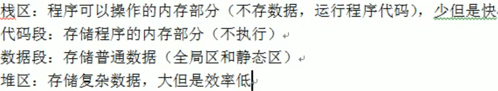
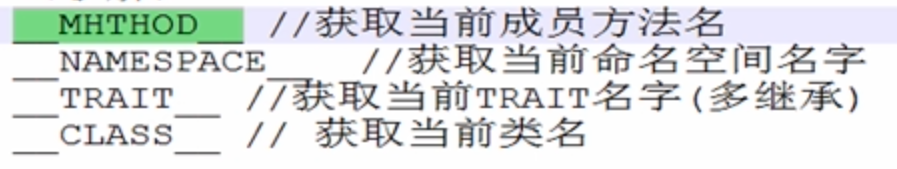
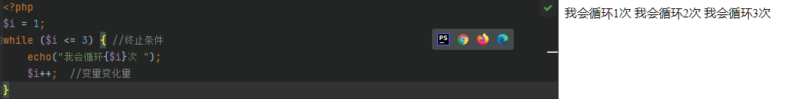
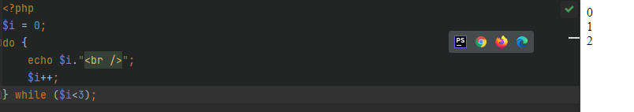

# PHP

## 前导（内存）

1

## PHP简介

> PHP是运行在服务器端的HTML脚本/编程语言，用于书写动态的网页

## 网站的基本概念

### 服务器

> 能够提供服务的机器，取决于机器上所安装的软件（服务软件）

### 域名

> 是由一串用点分隔的名字组成的Internet上某一台计算机或计算机组名称

## Web程序的访问流程

### 宽泛流程

1. 浏览器发起访问
2. DNS解析域名
3. 服务器电脑
4. 服务软件

### 静态网站访问流程


### 动态网站访问


 

Apache 夹在PHP模块

## PHP基础

### 语法

==PHP是一种运行在服务器端的脚本语言，可以嵌入到HTML中==

==PHP是模块化的，需要使用什么就要开启哪个模块==

#### PHP代码标记

在PHP历史发展中，可以使用多种标记来区分PHP脚本

- ASP标记：<% php 代码 %>

- 短标记：

  - 以上两种基本弃用

- 脚本标记：

- 标准标记（常用）：

  - ```
    <?php  echo 2222; ?>
    ```

#### PHP注释

##### 行注释

```
// 注释
```

##### 块注释

```
/*
    注释
*/
```

### 变量

#### 变量的命名方式

==PHP变量命名必须以$符开始==

```
<?php
    $x = 1;
    $y = 2;
```

#### 命名规则

- 不能以数字或特殊字符开头（下划线不是特殊字符）
- 不能含有特殊字符
- 起名要有意义，基本遵循驼峰命名方法
- 严格区分大小写
- 允许中文变量（不建议使用）

#### 预定义变量

==系统提前定义的变量，存储许多需要用到的数据（预定义变量都是数组）==

- **$_GET**: 获取所有表单以 get 方式提交的数据
- **$_POST**: POST 提交的数据都会保存再次
- **$_REQUEST**: GET 和 POST提交的都会保存
- $GLOBALS: PHP 中的所有全局变量
- **$_SERVER**: 服务器信息
- **$_SEESSION**: session 会话数据
- **$_COOKIE**: cookie 会话数据
- $_ENV: 环境信息
- $_FILES: 用户上传的文件信息

#### 变量函数

- 判断变量是否存在：==isset();==
- 销毁变量：==unset();==

#### 可变变量

==如果一个变量保存的值刚好是另外一个变量的名字，那么可以直接通过访问一个变量的到另外一个变量的值：在变量前面多家一个$符==

```php
$a = 'b';
$b = 'bb';
$$a = 'bb';
```

.

#### 变量传值

==定义：将一个变量传值给另一个变量==

变量传值的两种方式

- 值传递：复制变量的值，将新值给另外一个变量保存（新旧变量指针指向不同）

  - ```php
    $新变量 = $老变量
    ```

- 引用传递：将变量值所在的内存地址，传递给另外一个变量（新旧变量指针指向相同）

  - ```php
    $新变量 = &$老变量
    ```

### 单引号和双引号

##### 区别

- 单引号不解析变量，双引号解析变量

  - ```php
    $name = '张三'
    echo 'name' // 输出：name
    echo "name" // 输出：张三
    ```

- 双引号解析转译字符,单引号不解析转译  \n   \r   \t   \

- 单引号执行转译   \\ \    和     \\' 

- 字符串与变量一起时通过 . 去连接

  - ```php
    echo $name.'李四'   // 张三李四
    ```

- 双引号里面插入单引号，单引号里面插入变量，变量会解析" '$a' "

  - ```php
    $a = 'a'; echo "'$a'";  // 输出 'a'
    ```

- 单引号效率比双引号块，能用单引号尽量使用单引号

- 如果再双引号里面插入变量，请在变量后面加上 空格 或 , 号

### 数据类型

#### 标量 scalar

- 整形 integer
  - 整数（正整数和负整数）
- 浮点型 double
  - 小数
- 布尔型 
  - True / False
- 字符串 str
  - 用引号引起来的都是字符串

#### 混合类型

- 数组

  - ```php
    @$arr = [1,2,3,4]
    ```

- 对象

  - object

#### 特殊类型

- 空
  - null
- 资源
  - resource
  - 图片、视频、网络请求等等都是资源

### 数据类型转换

#### 获取数据类型

```php
gettype($arr)
```

#### 标量转换

**强制类型转换时需注意**

==空转为整形等于 0，空转为浮点型等于浮点型的0，空转为字符串等于""(没有任何东西)==

==整形/浮点型如果后面有字符串，只会留下前面的数字==

| 原类型   | 目标类型 | 语法           |
| -------- | -------- | -------------- |
| 任意类型 | 整形     | intval($arr)   |
| 任意类型 | 浮点型   | floatval($arr) |
| 任意类型 | 字符串   | strval($arr)   |
| 任意类型 | 布尔类型 | boolval($arr)  |

#### 判断数据类型常用函数

- is_数据类型（判断是否为该数据类型，返回值时布尔类型）
  - 例如：is_array();  is_string();  is_bool();is_scalar(是否为标量);
- gettype(); //获取数据类型
- var_dome(); //输出值和数据类型

### 常量

==常量是程序运行的时候是不可以改变的量==

#### 语法

```php
define('常量名字'，'常量的值')
```

#### 注意事项

1. 不能重复定义
2. 常量的名字一般用大写字母
3. 常量的值只能是标量
4. 常量的作用域是全局的
5. 输出的时候没有$符号
6. 常量不能写到字符串中

#### 判断常量是否被定义

```php
defined('常量名')  // 返回值是布尔值
```


#### 系统常量

-  \__FILE__
  - 输出当前文件位置
- \__LINE__
  - 输出当前代码时第几行
- PHP_VERSION
  - 获取当前PHP版本号
- PHP_OS
  - 获取系统信息
- \__DIR__
  - 当前文件所在路径
- \__FUNCTION__
  - 获取函数名
- M_PI
  - 圆周率

了解即可

.

### 运算符

#### 算数运算符

| 符号 | 释义 |
| ---- | ---- |
| +    | 加   |
| -    | 减   |
| *    | 乘   |
| /    | 除   |
| %    | 求模 |

#### 自增/自减运算符

==i++自增/i--自减==

#### 比较运算符

| 符号 | 释义                           |
| ---- | ------------------------------ |
| >    | 大于                           |
| <    | 小于                           |
| >=   | 大于等于                       |
| <=   | 小于等于                       |
| ==   | 是否相等（值是否相等）         |
| ===  | 决对等于（数据类型是否也相等） |
| !=   | 不等于                         |
| !==  | 绝不等于                       |

#### 逻辑运算符

| 符号 | 释义 |
| ---- | ---- |
| &&   | 与   |
| \|\| | 或   |
| !    | 取反 |

### 为false的情况

1. 整形/浮点型为0为假，其他都为真
2. 空字符（空格也没有）、字符串 '0' 为假，但是字符串'0.0'为真
3. 空数组 $arr=[] 为假
4. null 为假

### 流程控制

#### if单分支

```php
if (条件) {
    真区间
}
```

#### if双分支

```php
if (条件) {
    真区间
}else {
    假区间
}
```

#### if多分支

```php
if (条件1) {
    代码1
} else if (条件2) {
    代码2
} else if (条件3) {
    代码3
} else {
    代码n
}
```

**释义**：

- 先判断条件1，满足条件1就执行条件1，其他不执行
- 若不满足条件1则向下判断条件2，满足则执行代码2，其他不执行
- 若依然不满足则继续往下，以此类推
- 若以上条件都不满足，执行else里的代码n
- 注意：可以写N个条件

#### switch流程控制语句

```php
switch (数据) {
	case 值1:
		代码1
		break
	case 值2:
		代码2
		break
	default:
		代码n
		break
}
```

#### 释义

- 找到跟小括号里数据**全等**的case值，并执行里面对应的代码
- 若没有全等 === 的则执行default里的代码

==注意：一定要加上break==

#### if多分支与switch的应用范围

- switch...case语句通常处理case为比较**确定值**的情况，而if...else..语句更加灵活，通常用于**范围判断**
- switch 语句进行判断后直接执行程序语句，效率更高，if...else语句有几种判断情况，就判断几次
- switch 一定要注意 必须是 === 全等（**数据类型**），注意**break**

### 循环语句

#### for循环

```php
for (变量起始值; 终止条件; 变量变化量){
    //循环体
}
// 示例
for ($i;$i<3;$i++) {
    echo $i. '<br />';
}
```

.

#### while循环

```php
$i = 1
while($i<=3){ //终止条件
    echo("我会循环{$i}次");
    i++;  //变量变化量
}
```

.

#### do ...  while

```php
$i = 0;
do {
    echo $i."<br />";
    $i++;
} while ($i<3)
```

.

#### do ... while和while的去辨别

while 循环首先检查条件是否满足，如果满足则执行循环体，否则跳过循环体，直接结束循环。因此，while 循环有可能一次也不执行。

相比之下，do-while 循环首先执行循环体，然后再检查条件是否满足。因此，do-while 循环至少会执行一次循环体。

#### for循环案例:九九乘法表

```php
for ($i = 1; $i <= 9; $i++) {
    echo '<tr>';
    for ($j = 1; $j <= $i; $j++) {
        echo '<td>' . $j . '*' . $i . '=' . $i * $j . '</td>';
    }
    echo '</tr>';
}
echo '</table>';
```

### break和continue

- 循环结束：
  - break：退出循环
  - continue：结束本次循环，继续下次循环
- 区别：
  - break：退出整个循环，一般用于结果已经得到，后续的循环不需要时
  - continue：退出整个循环，一般用于结果已经得到，后续的循环不需要的时候可以使用

### 函数

