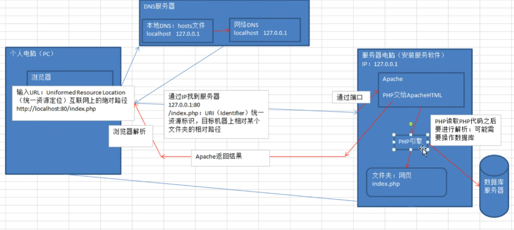

# PHP

## PHP简介

> PHP是运行在服务器端的HTML脚本/编程语言，用于书写动态的网页

## 网站的基本概念

### 服务器

> 能够提供服务的机器，取决于机器上所安装的软件（服务软件）

### 域名

> 是由一串用点分隔的名字组成的Internet上某一台计算机或计算机组名称

## Web程序的访问流程

### 宽泛流程

1. 浏览器发起访问
2. DNS解析域名
3. 服务器电脑
4. 服务软件

### 静态网站访问流程


### 动态网站访问



 

Apache 夹在PHP模块

## PHP基础

### 语法

> PHP是一种运行在服务器端的脚本语言，可以嵌入到HTML中
>
> PHP是模块化的，需要使用什么就要开启哪个模块

#### PHP代码标记

在PHP历史发展中，可以使用多种标记来区分PHP脚本

- ASP标记：<% php 代码 %>

- 短标记：

  - 以上两种基本弃用

- 脚本标记：

- 标准标记（常用）：

  - ```
    <?php  echo 2222; ?>
    ```

#### PHP注释

##### 行注释

```
// 注释
```

##### 块注释

```
/*
    注释
*/
```

### 变量

#### 变量的命名方式

> PHP变量命名必须以$符开始

```
<?php
    $x = 1;
    $y = 2;
```

#### 命名规则

- 不能以数字或特殊字符开头（下划线不是特殊字符）
- 不能含有特殊字符
- 起名要有意义